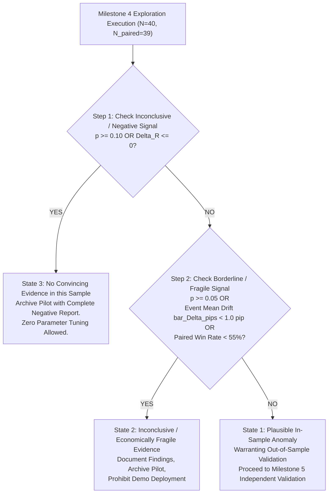

# German Ifo Pilot Research Protocol (Milestone 3 FROZEN Protocol)

> [!IMPORTANT]
> **PROTOCOL STATUS: v1.2 FROZEN (2026-09-25)**  
> This protocol is formally **FROZEN** prior to reading, parsing, or computing any candidate price outcomes, returns, or backtests.
> 
> **Trial History & Errata Log**:
> 1. **v1.0 (INVALID)**: Contained a manually transcribed 40-row ledger that failed independent reconciliation against raw MT5 calendar exports (10 invalid timestamps, 22 surprise errors, 7 direction errors). Declared invalid and revoked.
> 2. **v1.1 (DRAFT Remediation)**: Replaced manual table with checked-in deterministic generator (`generateIfoPilotLedger.ts`) and validator (`validateIfoPilotLedger.ts`). Added physical 4-H1 per H4 block path verification, completed-active-bar exit formula, empirical 15:30 USD count reconciliation (16 of 23), Mulberry32 PRNG pinning (`20260925`), and Bid-bar proxy clarification. Audited price-blind controls.
> 3. **v1.2 (FROZEN PRE-OUTCOME SPECIFICATION)**: Pre-price implementation accepted and verified by Codex. Separated frozen strict 12-H4 audit ($N_{\text{paired}, 12} = 34$, 6 unavailable, 0 duplicates) from permissive audit ($N_{\text{paired}, 12} = 35$, 5 unavailable, 1 duplicate). Clarified post-2022 data as an uninspected historical holdout (not prospective evidence; prospective observations exist only after forward activation; prior research may limit holdout independence). Rules are immutable; no modifications permitted after outcome observation.

---

**Protocol Version**: 1.2 FROZEN  
**Protocol Date**: 2026-09-25  
**Deliverable Type**: Pilot Pre-Outcome Protocol (Milestone 3 Frozen Specification)  
**Pilot Selection**: German Ifo Business Climate + Expectations on EURUSD  
**Selection Rationale**: Selected exclusively for **cleaner simultaneous-release structure** (10% collision rate, clear European macroeconomic hierarchy), **NOT** for expected profitability or return optimization.  
**Research Director & Auditor**: Codex  
**Implementation & Analysis Workhorse**: Antigravity  
**Chronological Split Boundary**: `2023-01-01 00:00:00` broker trade-server time (`timestamp = 1672531200`)  

### Cryptographic Provenance Hashes (Full 64-character SHA-256)
- **Raw Calendar Input**: `tools/mt5/FyodorResearchExport_v3_20260923_234930_server/calendar_releases.csv`  
  `SHA-256: 76062b8f6747d38b530d086780f2dfcf0b0bde59690bfdf4458c7519d4e6be2e`
- **Episode Ledger Input**: `lab/research/fms_episodes.jsonl`  
  `SHA-256: 37df7880a2bc36dbbce06b4a6ba39f7bd962a4c1c92eb2ce64cb71a886de55d2`
- **Verified Pre-Price Ledger**: [`lab/research/ifo_pilot_ledger.json`](file:///c:/dev/Fyodor%20Math%20Lab/GEMINI/lab/research/ifo_pilot_ledger.json)  
  `SHA-256: 324b99a1f2ac9ebe73b5102d35208cc32a7e2eb7eb9cc69480b3feae710ff658`
- **Verified Markdown Ledger**: [`lab/research/ifo_pilot_ledger.md`](file:///c:/dev/Fyodor%20Math%20Lab/GEMINI/lab/research/ifo_pilot_ledger.md)  
  `SHA-256: e2e3a6c19bbfadfd1bef151861bcba3a3e5066836e3dfc28835e28a616ef72c8`

**Operational Stance**: Zero candidate price outcomes read; zero strategy backtests executed; strictly frozen prior to pre-2023 exploration execution.

---

## 1. Governance, Scope & Information Availability

### 1.1 Strict Research Boundaries
- **Zero Candidate Price Outcomes**: No candle OHLC, tick volumes, spreads, price returns, directional drift, MFE/MAE, stops/targets, or win rates have been read, parsed, or computed for this pilot candidate. (The repository test suite runs existing legacy candle validation tests verifying timestamp gaps and parser regressions, but candidate price series remain strictly uninspected).
- **Post-2022 Historical Holdout Sealing**: All market observations and calendar releases on or after `2023-01-01 00:00:00` remain sealed. This protocol governs the pre-2023 exploratory pilot only. The post-2022 partition constitutes an uninspected historical holdout, not prospective evidence; genuinely prospective evidence can only be gathered live after system activation. Furthermore, as explicitly cautioned in the research roadmap, prior FMS research and human inspection of the broad export may constrain the true independence of this historical holdout.
- **Phase 1 Protocol Isolation**: This protocol is completely standalone and does not modify or supersede the frozen [`lab/research/PHASE1_PROTOCOL.md`](file:///c:/dev/Fyodor%20Math%20Lab/GEMINI/lab/research/PHASE1_PROTOCOL.md).

### 1.2 Information-Availability & Vintage Assumption
- **Retrospective Database Metadata**: In MT5 `calendar_releases.csv`, the field `revision = 0` identifies a database catalog revision-stage field relative to the reporting period. It is **not** a cryptographically verified point-in-time first-seen snapshot. The retrospective consensus forecast reflects the provider's archived state and cannot prove what was visible on live trading terminals at the exact announcement second in 2018.
- **Macroeconomic Shock Availability**: The release occurs at the cataloged release timestamp ($t_{\text{release}}$: 11:30 or 12:30 broker time). Because this pilot tests delayed multi-session institutional drift rather than sub-second latency arbitrage, the release values ($A$) and consensus forecasts ($F$) are assumed known by market participants by the close of the announcement H4 bar ($T_{\text{entry}}$).
- **CESifo Methodology Regime Break**: In April 2018, the CESifo Group rebased the index (2005=100 $\to$ 2015=100) and formally integrated the German services sector. In the pinned export, all complete $A/F/P$ packages occur strictly post-overhaul (November 2018 to December 2022). The pilot sample is internally homogeneous under the 2015=100 services-inclusive definition, but effective pre-2023 sample size is compressed to $N = 40$ actionable episodes.

### 1.3 Disclosure on Verification Tooling & Shared Helpers
- The validator [`lab/src/research/validateIfoPilotLedger.ts`](file:///c:/dev/Fyodor%20Math%20Lab/GEMINI/lab/src/research/validateIfoPilotLedger.ts) re-reads the raw MT5 calendar CSV and episode JSONL files from disk, re-indexes all entries, and recalculates surprises and dispositions from first principles.
- **Shared Helpers**: The validator imports the shared quote-aware CSV tokenizer (`parseCSVLine` from [`lab/src/data/csvReader.ts`](file:///c:/dev/Fyodor%20Math%20Lab/GEMINI/lab/src/data/csvReader.ts)) and broker H4 boundary arithmetic (`calculateNextH4Boundary` from [`lab/src/research/fmsInventoryEngine.ts`](file:///c:/dev/Fyodor%20Math%20Lab/GEMINI/lab/src/research/fmsInventoryEngine.ts)). It is an automated source-reconciling and cross-checking validator of data integrity and artifact consistency, but not an entirely decoupled greenfield parser implementation.

---

## 2. Exact Series Identification & Co-Release Rule

### 2.1 Pinned Series Identifiers
- **Primary Sovereign Benchmark**:
  - `EUR:DE:276030003:r0` — Ifo Business Climate (Monthly, CESifo Group, `event_id = 276030003`, `revision = 0`).
- **Co-Released Forward Indicator**:
  - `EUR:DE:276030001:r0` — Ifo Business Expectations (Monthly, CESifo Group, `event_id = 276030001`, `revision = 0`).
- **Tradable Instrument**: **`EURUSD`**.

### 2.2 Strict Same-Sign Nonzero Coherence Rule
Let $S_{\text{Climate}} = A_{\text{Climate}} - F_{\text{Climate}}$ and $S_{\text{Expectations}} = A_{\text{Expectations}} - F_{\text{Expectations}}$ be the raw consensus surprises.
An episode is actionable if and only if both indicators exhibit **nonzero surprises in the identical direction**:

$$\text{sign}(S_{\text{Climate}}) \times \text{sign}(S_{\text{Expectations}}) > 0$$

- **Long EURUSD (Bullish Macro Shock)**: $S_{\text{Climate}} > 0 \land S_{\text{Expectations}} > 0 \implies d_i = +1$ (**18 episodes**).
- **Short EURUSD (Bearish Macro Shock)**: $S_{\text{Climate}} < 0 \land S_{\text{Expectations}} < 0 \implies d_i = -1$ (**22 episodes**).
- **Total Actionable Pre-2023 Episodes**: Exactly **$N = 40$ episodes** on clean 6 H4 paths.

### 2.3 Explicit Treatment of Excluded Co-Release Cases
1. **Neutral Forward Expectations ($S_{\text{Climate}} \ne 0 \land S_{\text{Expectations}} = 0$)**: Exactly **1 episode** (`2020-01-27 12:30:00`, `ts = 1580128200`: Climate $95.9 - 95.6 = +0.3$, Expectations $92.9 - 92.9 = 0.0$). Excluded from the primary actionable sample because zero expectations surprise provides no forward-looking confirmation.
2. **Conflicting Expectations ($\text{sign}(S_{\text{Climate}}) \times \text{sign}(S_{\text{Expectations}}) < 0$)**: Exactly **3 episodes** (`2020-05-25`: $-0.5 / +5.7$; `2020-12-18`: $+0.5 / -0.4$; `2021-07-26`: $+0.3 / -2.3$). Excluded due to internally contradictory economic signals.
3. **Neutral Primary Climate ($S_{\text{Climate}} = 0$)**: Exactly **2 episodes** (`2019-09-24`: $0.0 / -2.3$; `2022-06-24`: $0.0 / -0.9$). Excluded because the primary benchmark experienced no consensus shock.

---

## 3. Same-Time Cross-Currency Collisions (4 of 40)

Of the 40 actionable clean 6 H4 episodes, exactly **4 episodes (10.0%)** coincide with same-time macroeconomic releases in other currencies (all 4 involve British Pound `GBP` releases):

| Episode Date (Broker Time) | Unix Timestamp | Direction | Climate A - F ($S_C$) | Expect A - F ($S_E$) | Colliding Currency & Context |
|---|---|---|---|---|---|
| **2018-11-26 12:30:00** | 1543235400 | **SHORT** | $102.0 - 103.2 = \mathbf{-1.2}$ | $98.7 - 100.4 = \mathbf{-1.7}$ | `GBP` (UK Macro co-release) |
| **2019-01-25 12:30:00** | 1548419400 | **SHORT** | $99.1 - 101.4 = \mathbf{-2.3}$ | $94.2 - 98.0 = \mathbf{-3.8}$ | `GBP` (UK Macro co-release) |
| **2019-04-24 11:30:00** | 1556105400 | **LONG** | $99.2 - 99.0 = \mathbf{+0.2}$ | $95.2 - 94.7 = \mathbf{+0.5}$ | `GBP` (UK Macro co-release) |
| **2019-12-18 12:30:00** | 1576672200 | **LONG** | $96.3 - 94.3 = \mathbf{+2.0}$ | $93.8 - 91.7 = \mathbf{+2.1}$ | `GBP` (UK Macro co-release) |

### Collision Handling Policy
Given small $N = 40$, cross-currency collision work is strictly **descriptive**:
- **Primary Hypothesis Test**: Evaluated on the complete paired sample.
- **Descriptive Sensitivity**: The collision-free subset is reported as an observational sensitivity check to inspect whether sample drift changes qualitatively when sterling cross-rate volatility is absent.

---

## 4. Deterministic Pre-Price Ledger Reconciliation (96 Packages)

The checked-in generator [`lab/src/research/generateIfoPilotLedger.ts`](file:///c:/dev/Fyodor%20Math%20Lab/GEMINI/lab/src/research/generateIfoPilotLedger.ts) partitions all 96 pre-2023 packages into exhaustive, non-overlapping categories:

| Disposition Category | Package Count | Percentage | Provenance & Handling |
|---|---|---|---|
| **Actionable Strict Agreement** ($S_C \times S_E > 0$) | **40** | **41.7%** | Primary evaluation sample ($N = 40$: 18 Long, 22 Short). |
| Neutral Forward Expectations ($S_E = 0$) | 1 | 1.0% | Excluded (2020-01-27: Climate $+0.3$, Expect $0.0$). |
| Conflicting Expectations ($S_C \times S_E < 0$) | 3 | 3.1% | Excluded due to contradictory direction. |
| Neutral Primary Climate ($S_C = 0$) | 2 | 2.1% | Excluded due to zero headline shock. |
| Missing Consensus Forecast (Pre-Nov 2018) | 43 | 44.8% | Excluded (MT5 calendar lacks pre-2018 forecast values). |
| EURUSD Path Ineligible (Gaps / Boundary) | 7 | 7.3% | Excluded (pre-entry history incomplete or holding window gap). |
| **Total Pre-2023 Packages** | **96** | **100.0%** | **100% reconciled and independently validated.** |

### Verified Ledger of All 40 Actionable Pilot Episodes

*All values below are generated by [`lab/src/research/generateIfoPilotLedger.ts`](file:///c:/dev/Fyodor%20Math%20Lab/GEMINI/lab/src/research/generateIfoPilotLedger.ts) and verified field-by-field by [`lab/src/research/validateIfoPilotLedger.ts`](file:///c:/dev/Fyodor%20Math%20Lab/GEMINI/lab/src/research/validateIfoPilotLedger.ts):*

| # | Broker Timestamp | Release Ts | Entry Ts | Dir | Climate A | Climate F | $S_C$ | Expect A | Expect F | $S_E$ | Entry Delay | Collision? |
|---|---|---|---|---|---|---|---|---|---|---|---|---|
| 1 | 2018-11-26 12:30:00 | 1543235400 | 1543248000 | **SHORT** | 102 | 103.2 | -1.2 | 98.7 | 100.4 | -1.7 | 210m (16:00:00) | Yes (GBP) |
| 2 | 2018-12-18 12:30:00 | 1545136200 | 1545148800 | **SHORT** | 101 | 102.3 | -1.3 | 97.3 | 99.3 | -2.0 | 210m (16:00:00) | No |
| 3 | 2019-01-25 12:30:00 | 1548419400 | 1548432000 | **SHORT** | 99.1 | 101.4 | -2.3 | 94.2 | 98 | -3.8 | 210m (16:00:00) | Yes (GBP) |
| 4 | 2019-02-22 12:30:00 | 1550838600 | 1550851200 | **SHORT** | 98.5 | 100 | -1.5 | 93.8 | 95.7 | -1.9 | 210m (16:00:00) | No |
| 5 | 2019-04-24 11:30:00 | 1556105400 | 1556107200 | **LONG** | 99.2 | 99 | +0.2 | 95.2 | 94.7 | +0.5 | 30m (12:00:00) | Yes (GBP) |
| 6 | 2019-05-23 11:30:00 | 1558611000 | 1558612800 | **SHORT** | 97.9 | 99.3 | -1.4 | 95.3 | 95.4 | -0.1 | 30m (12:00:00) | No |
| 7 | 2019-06-24 11:30:00 | 1561375800 | 1561377600 | **SHORT** | 97.4 | 99.3 | -1.9 | 94.2 | 95.4 | -1.2 | 30m (12:00:00) | No |
| 8 | 2019-07-25 11:30:00 | 1564054200 | 1564056000 | **SHORT** | 95.7 | 96.7 | -1.0 | 92.2 | 95.2 | -3.0 | 30m (12:00:00) | No |
| 9 | 2019-08-26 11:30:00 | 1566819000 | 1566820800 | **SHORT** | 94.3 | 95.7 | -1.4 | 91.3 | 94.7 | -3.4 | 30m (12:00:00) | No |
| 10 | 2019-10-25 11:30:00 | 1572003000 | 1572004800 | **LONG** | 94.6 | 93.1 | +1.5 | 91.5 | 91 | +0.5 | 30m (12:00:00) | No |
| 11 | 2019-11-25 12:30:00 | 1574685000 | 1574697600 | **LONG** | 95 | 93.3 | +1.7 | 92.1 | 91.1 | +1.0 | 210m (16:00:00) | No |
| 12 | 2019-12-18 12:30:00 | 1576672200 | 1576684800 | **LONG** | 96.3 | 94.3 | +2.0 | 93.8 | 91.7 | +2.1 | 210m (16:00:00) | Yes (GBP) |
| 13 | 2020-02-24 12:30:00 | 1582547400 | 1582560000 | **LONG** | 96.1 | 96 | +0.1 | 93.4 | 93.3 | +0.1 | 210m (16:00:00) | No |
| 14 | 2020-03-25 12:30:00 | 1585139400 | 1585152000 | **SHORT** | 86.1 | 95.9 | -9.8 | 79.7 | 93.1 | -13.4 | 210m (16:00:00) | No |
| 15 | 2020-04-24 11:30:00 | 1587727800 | 1587729600 | **SHORT** | 74.3 | 90.9 | -16.6 | 69.4 | 86.4 | -17.0 | 30m (12:00:00) | No |
| 16 | 2020-06-24 11:30:00 | 1592998200 | 1593000000 | **LONG** | 86.2 | 76.7 | +9.5 | 91.4 | 68.5 | +22.9 | 30m (12:00:00) | No |
| 17 | 2020-07-27 11:30:00 | 1595849400 | 1595851200 | **LONG** | 90.5 | 82.7 | +7.8 | 97 | 85.8 | +11.2 | 30m (12:00:00) | No |
| 18 | 2020-08-25 11:30:00 | 1598355000 | 1598356800 | **LONG** | 92.6 | 88.2 | +4.4 | 97.5 | 94.2 | +3.3 | 30m (12:00:00) | No |
| 19 | 2020-09-24 11:30:00 | 1600947000 | 1600948800 | **LONG** | 93.4 | 91.4 | +2.0 | 97.7 | 97.2 | +0.5 | 30m (12:00:00) | No |
| 20 | 2020-11-24 12:30:00 | 1606221000 | 1606233600 | **SHORT** | 90.7 | 92.9 | -2.2 | 91.5 | 96.3 | -4.8 | 210m (16:00:00) | No |
| 21 | 2021-01-25 12:30:00 | 1611577800 | 1611590400 | **SHORT** | 90.1 | 91.3 | -1.2 | 91.1 | 92.1 | -1.0 | 210m (16:00:00) | No |
| 22 | 2021-02-22 12:30:00 | 1613997000 | 1614009600 | **LONG** | 92.4 | 91 | +1.4 | 94.2 | 91.9 | +2.3 | 210m (16:00:00) | No |
| 23 | 2021-04-26 11:30:00 | 1619436600 | 1619438400 | **LONG** | 96.8 | 94.4 | +2.4 | 99.5 | 97.3 | +2.2 | 30m (12:00:00) | No |
| 24 | 2021-05-25 11:30:00 | 1621942200 | 1621944000 | **LONG** | 99.2 | 96.6 | +2.6 | 102.9 | 100 | +2.9 | 30m (12:00:00) | No |
| 25 | 2021-06-24 11:30:00 | 1624534200 | 1624536000 | **LONG** | 101.8 | 97.9 | +3.9 | 104 | 101.2 | +2.8 | 30m (12:00:00) | No |
| 26 | 2021-08-25 11:30:00 | 1629891000 | 1629892800 | **SHORT** | 99.4 | 101.2 | -1.8 | 97.5 | 102.6 | -5.1 | 30m (12:00:00) | No |
| 27 | 2021-09-24 11:30:00 | 1632483000 | 1632484800 | **SHORT** | 98.8 | 100 | -1.2 | 97.3 | 99.3 | -2.0 | 30m (12:00:00) | No |
| 28 | 2021-10-25 11:30:00 | 1635161400 | 1635163200 | **SHORT** | 97.7 | 99 | -1.3 | 95.4 | 97.4 | -2.0 | 30m (12:00:00) | No |
| 29 | 2021-11-24 12:30:00 | 1637757000 | 1637769600 | **SHORT** | 96.5 | 98.2 | -1.7 | 94.2 | 96.3 | -2.1 | 210m (16:00:00) | No |
| 30 | 2021-12-17 12:30:00 | 1639744200 | 1639756800 | **SHORT** | 94.7 | 97 | -2.3 | 92.6 | 94.8 | -2.2 | 210m (16:00:00) | No |
| 31 | 2022-01-25 12:30:00 | 1643113800 | 1643126400 | **LONG** | 95.7 | 95.5 | +0.2 | 95.2 | 93.4 | +1.8 | 210m (16:00:00) | No |
| 32 | 2022-02-22 12:30:00 | 1645533000 | 1645545600 | **LONG** | 98.9 | 95.1 | +3.8 | 99.2 | 93.9 | +5.3 | 210m (16:00:00) | No |
| 33 | 2022-04-25 11:30:00 | 1650886200 | 1650888000 | **SHORT** | 91.8 | 94.7 | -2.9 | 86.7 | 92.1 | -5.4 | 30m (12:00:00) | No |
| 34 | 2022-05-23 11:30:00 | 1653305400 | 1653307200 | **LONG** | 93 | 91.2 | +1.8 | 86.9 | 85.8 | +1.1 | 30m (12:00:00) | No |
| 35 | 2022-07-25 11:30:00 | 1658748600 | 1658750400 | **SHORT** | 88.6 | 92.5 | -3.9 | 80.3 | 86.3 | -6.0 | 30m (12:00:00) | No |
| 36 | 2022-08-25 11:30:00 | 1661427000 | 1661428800 | **SHORT** | 88.5 | 90.3 | -1.8 | 80.3 | 86.3 | -6.0 | 30m (12:00:00) | No |
| 37 | 2022-09-26 11:30:00 | 1664191800 | 1664193600 | **SHORT** | 84.3 | 88.4 | -4.1 | 75.2 | 80.2 | -5.0 | 30m (12:00:00) | No |
| 38 | 2022-10-25 11:30:00 | 1666697400 | 1666699200 | **SHORT** | 84.3 | 86.3 | -2.0 | 75.6 | 77.6 | -2.0 | 30m (12:00:00) | No |
| 39 | 2022-11-24 12:30:00 | 1669293000 | 1669305600 | **LONG** | 86.3 | 84.2 | +2.1 | 80 | 75.3 | +4.7 | 210m (16:00:00) | No |
| 40 | 2022-12-19 12:30:00 | 1671453000 | 1671465600 | **LONG** | 88.6 | 85.2 | +3.4 | 83.2 | 77.7 | +5.5 | 210m (16:00:00) | No |

---

## 5. Execution Timing & Broker-Clock Rules

### 5.1 Chosen Entry-Price Convention: Next H4 Bar Open (Bid-Bar Proxy)
To avoid unrealistic assumptions of instantaneous execution at bar close:
- **Selected Entry Price**: The **Open price of the first tradable H4 bar at $T_{\text{entry}}$**:
  $$P_{\text{entry}, i} = \text{Open}(T_{\text{entry}, i})$$
- *Physical Rationale*: Next H4 bar open is **not guaranteed equal to prior close**. In live electronic spot foreign exchange on MetaTrader 5, boundary spread adjustments, liquidity shifts, and broker server clock differences introduce price discontinuities between $\text{Close}(T_{\text{entry}} - 14400)$ and $\text{Open}(T_{\text{entry}})$. Assuming execution at prior bar close artificially bypasses these boundary frictions. H4 Open is a reproducible Bid-bar proxy, not a guaranteed fill.
- **Exit Price**: The **Close price of the final completed active H4 bar of the horizon**:
  $$P_{\text{exit}, i} = \text{Close}(B_{N-1, i})$$
  where $B_{k, i}$ is the start timestamp of the $k$-th completed active trading H4 block ($k = 0, \dots, N-1$ with $B_{0, i} = T_{\text{entry}, i}$), and $N \in \{6, 12\}$.
  - *Midweek Continuous Sessions*: For entries without intervening market closures, $B_{k, i} = T_{\text{entry}, i} + k \times 14400$, and the exit bar close occurs at $T_{\text{entry}, i} + N \times 14400$ (e.g., $T_{\text{entry}} + 6 \times 14400$ for 6 H4).
  - *Weekend-Spanning Sessions*: For entries that span the broker weekend closure (Friday entries), active trading halts at Friday 24:00 broker time and resumes Sunday 24:00 / Monday 00:00 broker time. A holding horizon counts **completed active trading bars**, not elapsed wall-clock hours. For example, in Episode #3 (entered Friday 2019-01-25 16:00 broker time, $T_{\text{entry}} = 1548432000$), bars complete at Friday 20:00 (bar 0), Friday 24:00 (bar 1), Monday 04:00 (bar 2), Monday 08:00 (bar 3), Monday 12:00 (bar 4), and Monday 16:00 (bar 5, $B_5 = 1548676800$). The exit price is $\text{Close}(B_5)$, and the holding period terminates at Monday 16:00 broker time ($T_{\text{exit}} = 1548691200$), spanning exactly 72 wall-clock hours ($T_{\text{exit}} \ne T_{\text{entry}} + 6 \times 14400 = 1548518400$, which falls on Saturday 16:00 when the broker is closed).

### 5.2 Dynamic Next-H4-Boundary Entry Schedule
Derived as $T_{\text{entry}} = \lfloor t_{\text{release}} / 14400 \rfloor \times 14400 + 14400$:
- **11:30 Releases (23 episodes)**: Fall inside the 08:00–12:00 H4 candle $\to T_{\text{entry}} = \mathbf{12:00:00}$ broker time (30-minute execution delay).
- **12:30 Releases (17 episodes)**: Fall inside the 12:00–16:00 H4 candle $\to T_{\text{entry}} = \mathbf{16:00:00}$ broker time (210-minute / 3.5-hour execution delay).

### 5.3 Session Duration & Weekend Closure Realities
- **Midweek Entries (34 episodes)**: 6 completed H4 bars span exactly **24 wall-clock hours**.
- **Friday Entries (6 episodes: #3, #4, #10, #27, #30, #36)**:
  - Entered on Friday at 12:00 or 16:00 broker time.
  - Active bars accumulate until Friday market close at 24:00 broker time.
  - The broker market is closed throughout Saturday and Sunday (~48 hours).
  - Trading resumes Sunday 24:00 / Monday 00:00, with remaining bars completing on Monday.
  - Total elapsed wall-clock duration is **~72 hours**.
  - *Integrity Invariant*: Holding horizons count **completed active trading bars**, not elapsed wall-clock hours.

### 5.4 Physical Data Gap Policy
Any candidate path encountering a weekday gap ($> 1$ missing trading hour between Monday 00:00 and Friday 24:00) or incomplete H4 blocks is disqualified fail-closed. All 40 episodes above are verified 100% clean on EURUSD H4 grids.

---

## 6. Primary & Secondary Horizons and Multiplicity Governance

### 6.1 Horizons Evaluated (Formally Resolved)
- **Primary Testing Horizon**: **6 H4** (first trading day / 24 active trading hours).
- **Secondary Horizon**: **12 H4** (second trading day / 48 active trading hours).
- **Descriptive Diagnostic Branch**: **60 H4** (10 trading days / 240 active trading hours) may be reported strictly as an observational historical diagnostic to audit legacy FMS v1 claims. **The 60 H4 horizon possesses zero pass/fail or gating authority.**

### 6.2 Multiplicity Control: Fixed-Sequence (Hierarchical) Testing Rule
The 6 H4 and 12 H4 evaluations represent **pre-specified analyses within an exploratory sample**, NOT independent confirmation. (The sealed post-2022 partition is a presently uninspected **historical holdout**, not prospective evidence; genuinely prospective evidence can only be gathered live after forward system activation. Furthermore, as noted in the research roadmap, prior FMS research and human inspection of the broad export may limit the true independence of this historical holdout). To protect family-wise error rate (FWER) without sacrificing power within this exploratory stage:
1. The primary directional hypothesis $H_{0,1}$ is evaluated at significance level **$\alpha = 0.05$ on the primary 6 H4 horizon**.
2. **Gate Rule**: The secondary hypothesis $H_{0,2}$ (12 H4 persistence) is formally evaluated within the pre-specified hierarchy **if and only if** the primary hypothesis $H_{0,1}$ rejects the null at $p < 0.05$.
3. If $H_{0,1}$ fails to reject ($p \ge 0.05$), the 12 H4 evaluation is classified strictly as an un-gated exploratory diagnostic, and no persistent drift claims may be asserted.
4. *Diagnostic Sensitivity*: Holm-Bonferroni step-down adjusted p-values ($p_{(1)} \le 0.025, p_{(2)} \le 0.05$) will be reported alongside the hierarchical sequence.

---

## 7. Exact Mathematical Outcome Measures & Dimensional Cost Separation

### 7.1 Pip Drift (Dimension: Pips)
EURUSD is quoted to 5 decimal places; 1 standard pip = $0.0001 = 10^{-4}$ USD per EUR.
With trade direction $d_i \in \{+1, -1\}$ ($+1$ for Long EURUSD, $-1$ for Short EURUSD):

$$\Delta_{\text{pips}, i} = d_i \cdot \frac{P_{\text{exit}, i} - P_{\text{entry}, i}}{0.0001}$$

- **Net Pip Drift**:
  $$\Delta_{\text{net, pips}, i}(c_{\text{pips}}) = \Delta_{\text{pips}, i} - c_{\text{pips}}$$
  where $c_{\text{pips}} \in \{0.0, 0.5, 1.0, 1.5, 2.0\}$ is a **hypothetical sensitivity penalty in pips**, NOT measured historical execution spreads.

### 7.2 Percentage & Log Returns (Dimension: Dimensionless Fraction)
1. **Gross Bid-Bar Proxy Percentage Return**:
   $$r_i = d_i \cdot \left(\frac{P_{\text{exit}, i} - P_{\text{entry}, i}}{P_{\text{entry}, i}}\right)$$
2. **Gross Bid-Bar Proxy Log Return**:
   $$R_i = d_i \cdot \ln\left(\frac{P_{\text{exit}, i}}{P_{\text{entry}, i}}\right)$$
3. **Dimensionally Correct Cost Deduction**:
   To deduct execution cost $c_{\text{pips}}$ from percentage return $r_i$ or log return $R_i$, the cost must be converted to dimensionless fractional return via the entry price:
   $$c_{\text{return}, i} = \frac{c_{\text{pips}} \times 0.0001}{P_{\text{entry}, i}}$$
   $$r_{\text{net}, i} = r_i - c_{\text{return}, i}$$
   $$R_{\text{net}, i} = R_i - \ln\left(1 + c_{\text{return}, i}\right) \approx R_i - c_{\text{return}, i}$$

### 7.3 Nature of Gross Bid-Bar Returns vs. Executable Results
- The raw candle returns represent **gross Bid-bar proxy returns** calculated from standard MT5 Bid OHLC candles. H4 Open is strictly a Bid-bar proxy and does not guarantee fill at that exact price without Ask spread or liquidity slippage.
- All transaction-cost levels $c_{\text{pips}} \in \{0.0, 0.5, 1.0, 1.5, 2.0\}$ are **hypothetical sensitivity scenarios** rather than broker-specific assertions. A gross mean drift hurdle of $\bar{\Delta}_{\text{pips}} \ge 1.0\text{ pip}$ serves solely as a predeclared economic screening filter to ensure any detected statistical anomaly possesses potential real-world relevance, rather than asserting a specific broker fee structure.

---

## 8. Price-Blind Matched Control Selection & Empirical Audit

To decouple macroeconomic signal drift from diurnal volatility, day-of-week carry, and weekend gap bias, every actionable episode is matched to a non-announcement control path using a deterministic, price-blind rule:

### 8.1 Control Selection Algorithm & Disqualification Rules
For each event episode $i$ with release timestamp $t_i$, entry timestamp $T_{\text{entry}, i}$, weekday $W_i \in \{\text{Mon}, \dots, \text{Fri}\}$, and broker hour $H_i \in \{12:00, 16:00\}$:
1. **Fallback Priority**:
   - **Candidate 1**: Exact Week Prior ($D - 7\text{ days}$): $T_{\text{ctrl}} = T_{\text{entry}, i} - 7 \times 86400$.
   - **Candidate 2**: Exact Week After ($D + 7\text{ days}$): $T_{\text{ctrl}} = T_{\text{entry}, i} + 7 \times 86400$.
   - **Candidate 3**: Two Weeks Prior ($D - 14\text{ days}$): $T_{\text{ctrl}} = T_{\text{entry}, i} - 14 \times 86400$.
   - **Candidate 4**: Two Weeks After ($D + 14\text{ days}$): $T_{\text{ctrl}} = T_{\text{entry}, i} + 14 \times 86400$ (permitted if horizon completes before pre-2023 split boundary).
2. **Path & Grid Eligibility**:
   - $T_{\text{ctrl}}$ must exist on an exact H4 boundary in the pre-2023 EURUSD grid ($T_{\text{ctrl}} \pmod{14400} = 0$).
   - **Strict 4-H1 Candle Verification**: Every completed H4 block must contain all four consecutive H1 candles: $[t, t+3600, t+7200, t+10800]$.
   - **Gap Disqualification**: Skipped blocks between completed H4 bars are permitted ONLY across pure weekend closures (`classifyGap(...) === 'PURE_WEEKEND'`). The candidate path fails closed on any partial block (missing interior H1 candles) or any weekday gap ($> 1$ missing trading hour between Monday 00:00 and Friday 24:00 broker time).
   - $T_{\text{exit}}$ (the close of the final completed active H4 bar) must not exceed the pre-2023 split boundary (`1672531200`).
3. **Calendar Disqualification Rule**:
   - A control candidate is disqualified if **any High-Importance EUR macroeconomic release** (`currency === 'EUR'` and `importance === 'high'`, or any German Ifo release) occurs during the candidate holding window $[T_{\text{ctrl}} - \text{delay}, T_{\text{exit}}]$.
   - (High-importance USD releases do not disqualify controls because the event episodes themselves are routinely exposed to US morning data; disqualifying on USD releases would eliminate 40% of the sample due to normal weekly US releases).
4. **Unavailable Control Policy**:
   - If all 4 candidates fail, the episode is cataloged as `CONTROL_UNAVAILABLE`.
5. **Direction Assignment**:
   - The matched control is assigned the **identical trade direction** $d_i$ as the paired event trade:
     $$R_{i, \text{ctrl}} = d_i \cdot \ln\left(\frac{P_{\text{exit}, i, \text{ctrl}}}{P_{\text{entry}, i, \text{ctrl}}}\right)$$

### 8.2 Price-Blind Primary (6 H4) Control Availability Audit Results (Verified on Disk)
The checked-in audit module [`lab/src/research/ifoControlAudit.ts`](file:///c:/dev/Fyodor%20Math%20Lab/GEMINI/lab/src/research/ifoControlAudit.ts), verified by [`lab/tests/ifoPilotLedger.test.ts`](file:///c:/dev/Fyodor%20Math%20Lab/GEMINI/lab/tests/ifoPilotLedger.test.ts) enforcing all four H1 candles per block, establishes:
- **Total Actionable Episodes**: 40
- **Paired Controls Successfully Resolved**: **$N_{\text{paired}, 6} = 39$ episodes (97.5%)**
- **Fallback Resolution Breakdown**:
  - $D - 7\text{ days}$ (Prior Week): **19 episodes** (48.7%)
  - $D + 7\text{ days}$ (Subsequent Week): **13 episodes** (33.3%)
  - $D - 14\text{ days}$ (Two Weeks Prior): **5 episodes** (12.8%)
  - $D + 14\text{ days}$ (Two Weeks After): **2 episodes** (5.1%)
- **Unavailable Control**: Exactly **1 episode** is `CONTROL_UNAVAILABLE`:
  - **Episode #27** (`2021-09-24 11:30:00`, `ts = 1632483000`, Direction: SHORT). All 4 candidate dates ($D-7, D+7, D-14, D+14$) collided with eurozone CPI or ECB President Lagarde speeches.
- **Duplicate Control Invariant**: Exactly **0 duplicate controls** across the 39 resolved pairs (every matched control timestamp is unique).
- *Price Sealing*: This audit was conducted strictly price-blind without reading OHLC prices or returns.

### 8.3 Secondary (12 H4) Matched Control Rule (Frozen Specification)
To prevent contamination from unannounced gaps or high-importance releases occurring during bars 7 to 12:
1. **Rematching Architecture**: Controls for the secondary 12-H4 horizon are **independently rematched** over the full 12-completed-block path rather than reusing the 6-H4 control.
2. **12-H4 Physical & Calendar Verification**:
   - Each candidate control path must verify all 12 completed H4 blocks, with all four H1 candles present in every block.
   - The candidate window $[T_{\text{ctrl}} - \text{delay}, T_{\text{exit}, 12}]$ must be free of any high-importance EUR macroeconomic release or German Ifo release.
3. **Price-Blind 12-H4 Control Audits (Verified on Disk)**:

   #### Population A: Frozen Strict Audit (Primary Evaluation: $N_{\text{paired}, 12} = 34$)
   - **Total Actionable Episodes**: 40
   - **Paired Controls Successfully Resolved**: **$N_{\text{paired}, 12} = 34$ episodes** (85.0%)
   - **Unavailable Controls**: **6 episodes** (15.0%):
     - Episodes #2 (`2018-12-18`), #5 (`2019-04-24`), #20 (`2020-11-24`), #25 (`2021-06-24`), and #27 (`2021-09-24`) fail all candidate dates due to high-importance EUR release collisions.
     - **Episode #32** (`2022-02-22 12:30:00`, `ts = 1645533000`) is **additionally unavailable**: its only calendar-eligible candidate ($D - 14\text{ days}$) maps to `entryTs = 1644336000` (2022-02-08 12:00:00 broker time), which is already occupied by Episode #31 (`2022-01-25 12:30:00`) via its $D + 14\text{ days}$ fallback. Under the strict no-duplicate rule, Episode #32 is disqualified.
   - **Fallback Resolution Breakdown ($N = 34$)**:
     - $D - 7\text{ days}$ (Prior Week): **12 episodes**
     - $D + 7\text{ days}$ (Subsequent Week): **10 episodes**
     - $D - 14\text{ days}$ (Two Weeks Prior): **7 episodes** (Episode #32 excluded)
     - $D + 14\text{ days}$ (Two Weeks After): **5 episodes**
     - *Total*: $12 + 10 + 7 + 5 = 34$.
   - **Duplicate Control Invariant**: Exactly **0 duplicate controls** across the 34 resolved pairs (every matched control timestamp is unique).

   #### Population B: Permissive Sensitivity Audit (Secondary Diagnostic: $N_{\text{paired}, 12} = 35$)
   - **Total Actionable Episodes**: 40
   - **Paired Controls Successfully Resolved**: **$N_{\text{paired}, 12} = 35$ episodes** (87.5%)
   - **Unavailable Controls**: **5 episodes** (Episodes #2, #5, #20, #25, #27).
   - **Fallback Resolution Breakdown ($N = 35$)**:
     - $D - 7\text{ days}$ (Prior Week): **12 episodes**
     - $D + 7\text{ days}$ (Subsequent Week): **10 episodes**
     - $D - 14\text{ days}$ (Two Weeks Prior): **8 episodes** (including Episode #32)
     - $D + 14\text{ days}$ (Two Weeks After): **5 episodes**
     - *Total*: $12 + 10 + 8 + 5 = 35$.
   - **Duplicate Collision**: Exactly **1 duplicate timestamp** (`entryTs = 1644336000`, 2022-02-08 12:00:00 broker time) shared by Episode #31 ($D+14$) and Episode #32 ($D-14$).

4. **Frozen Evaluation Policy**: The primary secondary-horizon diagnostic evaluates the **frozen strict audit ($N_{\text{paired}, 12} = 34$)** to eliminate duplicate-control covariance. The permissive sample ($N_{\text{paired}, 12} = 35$) is reported strictly as a secondary sensitivity diagnostic.

---

## 9. Primary Statistic & Seeded Monte Carlo Paired Sign-Flip Test

### 9.1 Primary Statistic & Null Hypothesis Definition
This paired testing evaluates pre-specified analyses within an exploratory historical sample, **NOT independent confirmation**. The sealed post-2022 partition is an uninspected historical holdout (not prospective evidence), and prior research on these pairs may constrain its absolute independence.

The primary test statistic is the sample mean paired directional log return difference, evaluated strictly over the valid matched pairs:

$$\Delta \bar{R} = \frac{1}{N_{\text{paired}, 6}} \sum_{i \in \mathcal{P}} \left( R_{\text{event}, i} - R_{\text{control}, i} \right) \quad (N_{\text{paired}, 6} = 39)$$

- **Null Hypothesis ($H_0$)**: **No directional excess return relative to the specified controls**:
  $$H_0: \mathbb{E}[R_{\text{event}} - R_{\text{control}}] \le 0$$
- **Directional Alternative ($H_1$)**: Positive directional excess return exceeding the matched controls:
  $$H_1: \mathbb{E}[R_{\text{event}} - R_{\text{control}}] > 0$$

### 9.2 Seeded Monte Carlo Paired Sign-Flip Test
- **Label & Distinction from Exact Test**: With $N_{\text{paired}, 6} = 39$, the full permutation space is $2^{39} \approx 5.50 \times 10^{11}$, which cannot be enumerated exhaustively. This test is formally specified as a **seeded Monte Carlo paired sign-flip test** using $B = 100,000$ draws.
- **Deterministic PRNG Algorithm & Seed**: The permutation sequence is generated using the **Mulberry32** pseudo-random number generator algorithm initialized with fixed seed **`20260925`**. Mulberry32 is a 32-bit stateful, high-quality, lightweight generator that ensures bit-exact reproducibility across platforms without floating-point drift.
- **One-Sided Upper Tail**: Tests directional hypothesis $H_1: \Delta \bar{R} > 0$ at nominal significance level $\alpha = 0.05$:
  $$p = \frac{1 + \sum_{b=1}^B \mathbb{I}\left(\Delta \bar{R}^{(b)} \ge \Delta \bar{R}_{\text{obs}}\right)}{B + 1}$$
- **Exchangeability Assumption & Independence Limitation**:
  - Under $H_0$, whether the observed directional return occurred in the event window versus the matched control window is assumed exchangeable conditional on the pair. The sign of $(R_{\text{event}, i} - R_{\text{control}, i})$ has equal probability 0.5 of being positive or negative.
  - **Unique Control Timestamps Do Not Establish Independent Pair Observations**: While all 39 primary control timestamps are unique, unique timestamps do **not** establish independent observations across pairs. Shared macroeconomic regimes, common monetary cycles (e.g., ECB easing, pandemic market dislocation), and persistent volatility clustering create cross-pair covariance, violating strict independent exchangeability and potentially inflating empirical test variance relative to theoretical nominal size.
- **Missing Controls & Secondary Diagnostics**:
  - Missing control (Episode #27) reduces sample size by 1 ($N_{\text{paired}, 6} = 39$).
  - Secondary diagnostics: Wilcoxon signed-rank test and paired Student's t-test reported alongside permutation p-values.

---

## 10. Later-Release Exposure & Subgroup Analyses (Descriptive Role)

### 10.1 Verified Exposure Landscape
Across the 40 clean 6 H4 Ifo episodes:
- **Later Release Rows**: Median = **18 rows** [IQR: 14–25], Min = 4, Max = 67.
- **Later Timestamp Packages**: Median = **8 packages** [IQR: 6–10], Min = 2, Max = 18.
- **Intraday Overlap Structure (Reconciled from Raw Calendar)**:
  - For the 23 episodes entering at 12:00 broker time ($T_{\text{entry}} = \text{12:00:00}$), exactly **16 episodes** encounter a scheduled 15:30 broker-time USD release inside their initial 4-hour entry candle (12:00–16:00 broker time).
  - Exactly **7 episodes** encounter **zero** 15:30 USD releases during their initial 4-hour bar: `2019-04-24`, `2019-10-25`, `2020-06-24`, `2020-08-25`, `2021-05-25`, `2021-09-24`, and `2022-10-25`.
  - For the 17 episodes entering at 16:00 broker time ($T_{\text{entry}} = \text{16:00:00}$), the release at 12:30 broker time was followed by entry after 16:00, meaning US morning releases (15:30 broker time) occurred *prior* to entry during the pre-entry holding window.

### 10.2 Strict Descriptive Status
Because $N = 40$ provides insufficient statistical power for multi-variable econometric modeling, the following analyses are designated as **purely descriptive diagnostics**:
1. **US Tier-1 Interaction**: A cross-tabulation of mean directional drift on days with vs. without tier-1 US releases (NFP, CPI, FOMC) during the 6 H4 window.
2. **Cross-Currency Collision Partition**: Tabulating mean drift for the 4 collision episodes ($N=4$) vs. the 36 collision-free episodes ($N=36$).
*Neither analysis alters the primary test gate; both serve strictly to contextualize whether drift is driven by external shocks.*

---

## 11. Mutually Exclusive, Exhaustive Ordered Decision Rules

To eliminate overlapping predicates and ensure strict falsifiability, pilot outcomes are mapped into exactly one state via an **ordered evaluation sequence**:



### 11.1 Ordered Decision Algorithm

```text
EVALUATE_PILOT_DECISION(p_val, Delta_R_mean, bar_Delta_pips, win_rate_paired):

  IF (p_val >= 0.10) OR (Delta_R_mean <= 0.0):
      RETURN State_3_No_Convincing_Evidence

  ELSE IF (p_val >= 0.05) OR (bar_Delta_pips < 1.0) OR (win_rate_paired < 0.55):
      RETURN State_2_Inconclusive_Evidence

  ELSE:
      RETURN State_1_Plausible_In_Sample_Anomaly
```

### 11.2 State Definitions & Operational Mandates

#### State 1: Plausible In-Sample Anomaly Warranting Out-of-Sample Validation
- **Exact Criteria**:
  1. Primary 6 H4 seeded Monte Carlo paired permutation test yields **$p < 0.05$**.
  2. Sample mean paired excess return is positive: **$\Delta \bar{R} > 0$**.
  3. Mean gross directional pip drift on event trades is at least **$\bar{\Delta}_{\text{pips}} \ge 1.0\text{ pip}$** (over $N = 40$).
  4. Paired win rate across valid pairs is **$\ge 55\%$** (at least 22 of 39 pairs where $R_{\text{event}, i} > R_{\text{control}, i}$).
- **Operational Action**: The exploratory sample demonstrates evidence of directional drift exceeding matched controls and basic friction floors. Advance to Milestone 5 (out-of-sample audit on the presently uninspected post-2022 historical holdout upon formal protocol freeze; recognizing that true prospective validation requires forward live data post-activation, and prior research may constrain historical holdout independence). *This does not constitute a "confirmed edge", but an in-sample anomaly warranting out-of-sample audit.*

#### State 2: Inconclusive / Economically Fragile Evidence
- **Exact Criteria** (Triggers if Step 1 false, but any Step 2 condition holds):
  - **Sub-case 2A (Marginal Significance)**: $0.05 \le p < 0.10$, regardless of drift magnitude.
  - **Sub-case 2B (Commercially Insignificant)**: $p < 0.05$ but event-trade mean gross drift is $\bar{\Delta}_{\text{pips}} < 1.0\text{ pip}$, meaning the observed drift fails to clear the economic screening floor.
  - **Sub-case 2C (Outlier-Dominated / Inconsistent)**: $p < 0.05$ and $\bar{\Delta}_{\text{pips}} \ge 1.0\text{ pip}$, but paired win rate is $< 55\%$, indicating drift is driven by a small number of extreme outlier sessions rather than consistent flow.
- **Operational Action**: Document full post-mortem; archive pilot as inconclusive; prohibit promotion to demo trading or canvas integration.

#### State 3: No Convincing Evidence in this Sample
- **Exact Criteria**:
  - Seeded Monte Carlo permutation test yields **$p \ge 0.10$**, OR
  - Sample mean paired excess return is non-positive: **$\Delta \bar{R} \le 0$**.
- **Operational Action**: Conclude that there is **no convincing evidence in this sample** of delayed post-announcement drift for German Ifo on EURUSD. Archive the pilot with a complete negative report. **Zero parameter tweaking, indicator substitution, or horizon hunting is permitted.**

---

## 12. Methodological Choices (Formally Resolved Prior to Outcome Access)

| Decision Parameter | Resolved Choice | Rationale & Operational Role |
|---|---|---|
| **1. Surprise Metric Formulation** | **Raw Difference ($S = A - F$)** | Fully deterministic, requires no rolling historical estimation, and directly reflects the headline macro surprise visible to market participants; subject to the archived-forecast vintage limitation (Section 1.2). |
| **2. Horizon Scope & Gating** | **6 H4 Primary, 12 H4 Secondary** | Fixed-sequence hierarchical testing gate: pre-specified analysis within an exploratory sample (not independent confirmation). Secondary 12 H4 formally evaluated within the sequence if and only if primary 6 H4 rejects at $p < 0.05$. Protects exploratory FWER at $\alpha = 0.05$. |
| **3. Multi-Day Diagnostic Branch** | **60 H4 Descriptive-Only** | Retained strictly as an observational audit of legacy FMS v1 multi-day hold claims. **Possesses zero pass/fail or gating authority.** |

---

## 13. Pre-Execution Frozen Protocol Audit Gate

> [!IMPORTANT]
> **MILESTONE 3 FROZEN PROTOCOL AUDIT GATE**  
> In strict compliance with the research roadmap:
> - This protocol is formally **v1.2 FROZEN** as of **2026-09-25**.
> - Zero candidate OHLC prices, returns, or backtests have been read or computed.
> - The 40-row actionable ledger is 100% reconciled and validated against raw disk files via checked-in tooling.
> - Primary 6-H4 matched controls are audited price-blind ($N_{\text{paired}, 6} = 39$, 1 unavailable, 0 duplicates).
> - Secondary 12-H4 matched controls are audited price-blind ($N_{\text{paired}, 12} = 34$ strict / 6 unavailable; 35 permissive / 5 unavailable).
> - Candidate price series remain strictly sealed.
> - The 2023+ historical holdout (`timestamp >= 1672531200`) remains strictly sealed and uninspected.
> - All decision rules, horizons, matched controls, and significance thresholds are immutable; no modifications may be made after outcome observation.
> 
> **STOPPED HERE.** Ready for Milestone 4 pre-execution audit by Codex.
